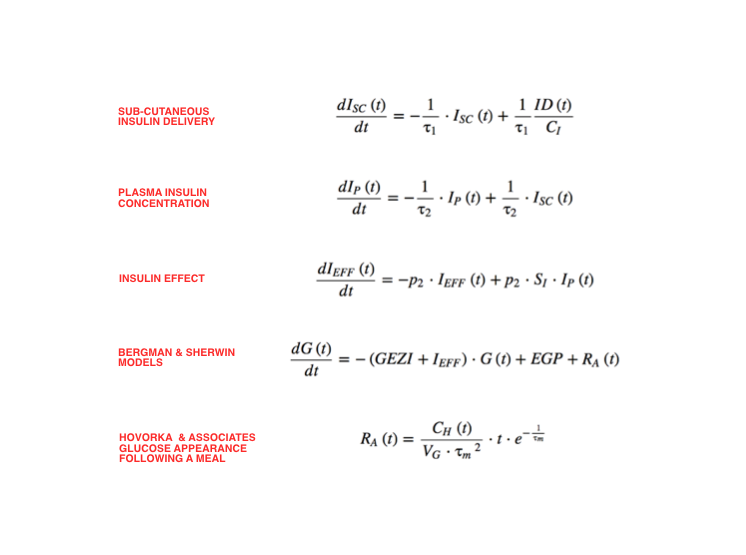
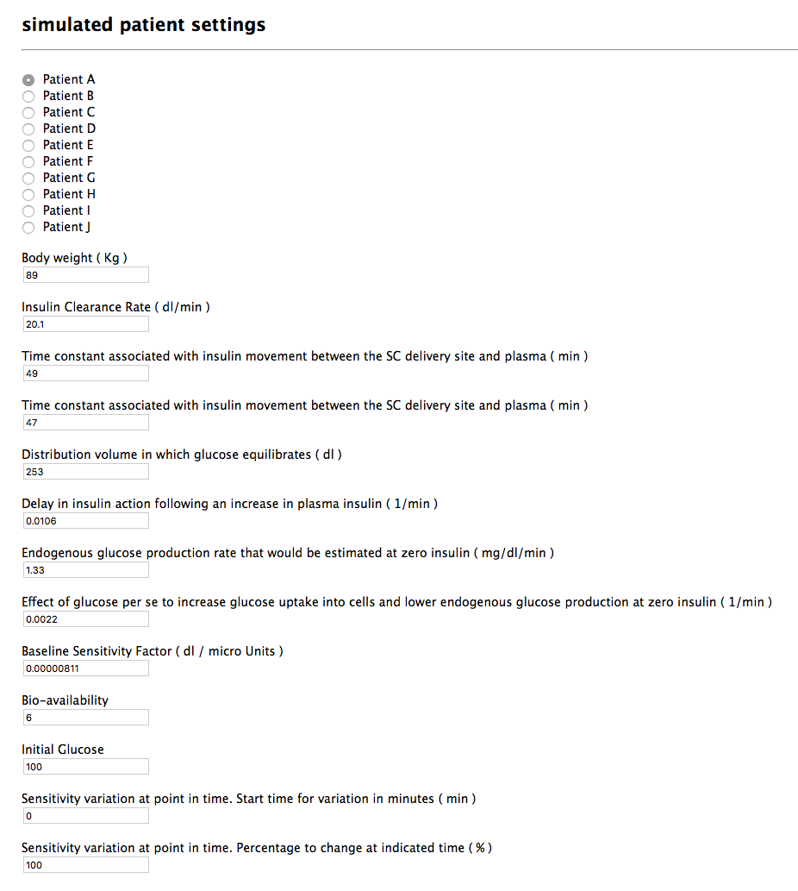
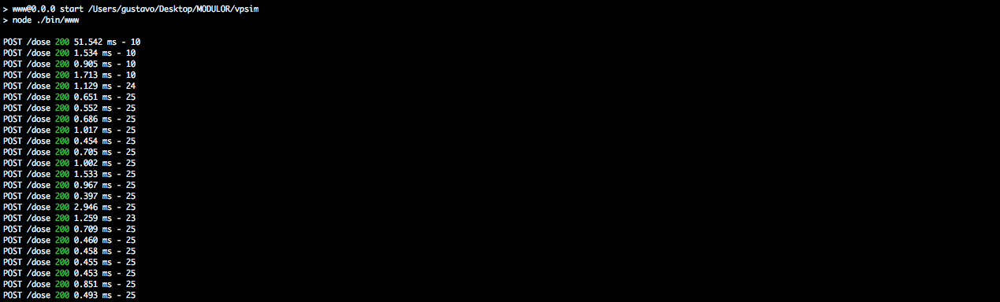
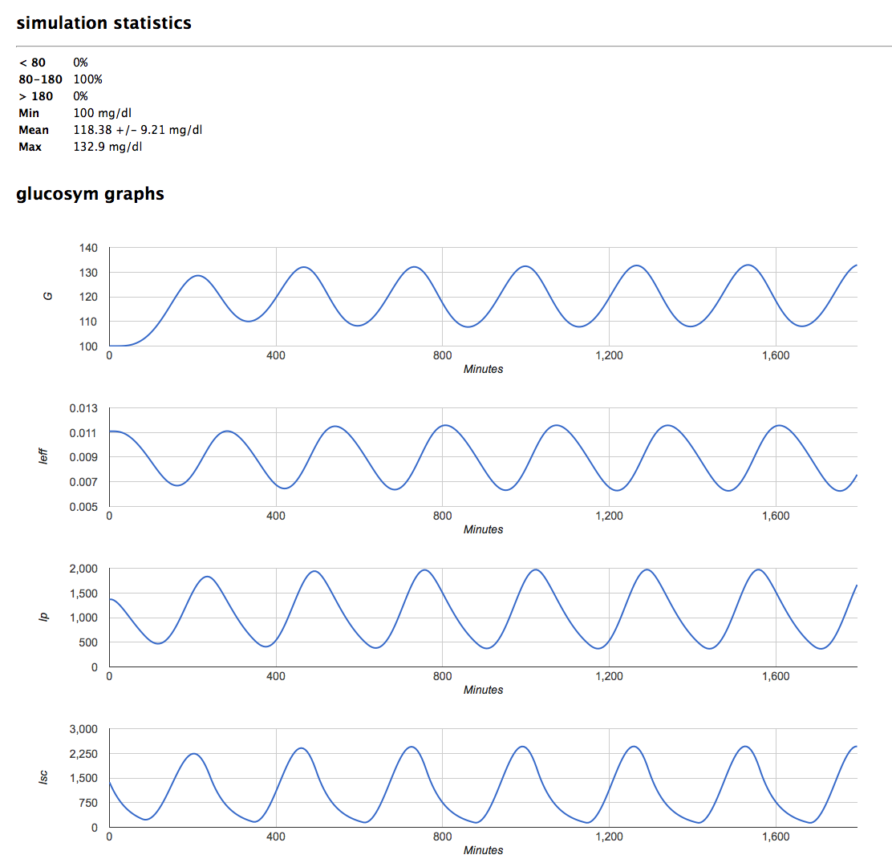

# GlucoSym

GlucoSym is an open-source simulator aimed to help in the testing and development of insulin delivery automation systems.

The simulator is based on the following equations:



It allows a developer to:

- Compare multiple algorithms on a same patient.
- Test on a patient with parameter variation during the day.
- Test against a population of patients

We hope GlucoSym will help develop faster, safer & more accessible software for the #wearenotwaiting community.

Remember GlucoSym is a work-in-progress!

## Setting-up

You will need [nodejs](https://nodejs.org) installed. If you haven't already done that head on over to [the nodejs website](https://nodejs.org) and install for your system.

Once installed, clone the repository on your computer:

```
$ git clone https://github.com/perceptus/glucosym.git
```

Then, to install required dependencies run:

```
$ npm install
```

## Starting GlucoSym

GlucoSym runs as a server on your computer so you can interact with it on your browser and have your own algorithm post data to it to get blood glucose values from the simulated patient back.

To start the server, open a terminal window and run:

```
$ npm start
```

If everything is installed correctly, you should see the following on the terminal:

```
> www@0.0.0 start /path_to/glucosym
> node ./bin/www
```

Now open your browser and navigate to http://localhost:3000 you should see GlucoSym UI:



When starting GlucoSym, by default "Patient A" is selected and its parameters are loaded. You can go through each parameter and modify it as needed before starting the simulation. If during the simulation, you change any of the parameters, the simulation will reset and you will loose all simulation history.

Once you change parameters, you are now ready to test!

## Setting up your algorithm and posting to GlucoSym

We recommend you to treat GlucoSym as your blood glucose source on your algorithm. Right now, you probably get a blood glucose from a CGM or Nightscout. You will have to create a way to post data to this server in order to get a blood glucose value back.

To start getting blood glucose values, you will have to post to GlucoSym /dose endpoint:

```
var url = 'http://localhost:3000/dose';
var request = require("sync-request");
postdata = { "dose": 0.0, "dt": 5, "index": 0, "time": 1080, "events": {"bolus": [{"amt": 0.0, "start": 60}], "basal": [{"amt": 1.3, "start": 0, "length": 600}], "carb": [{"amt": 0.0, "start": 600, "length": 90}]} };
request('POST', url, {json: postdata});

var response = JSON.parse(res3.getBody());
console.log(response.bg);
```

Here is a simple explanation of each of the post parameters:

* dose: Insulin dose in Units given during the time-step. In the case of a basal adjustment you will need to calculate how much insulin will be given in the time-step defined by dt ( ie how many inulin units will be given in 5 minutes by the set basal profile or temp basal? )
* dt: Change in time each step in minutes
* index: Current index from the start of the simulation, starting at 0
* time: Total simulation run-time in minutes
* events: You can set events so the simulator will consider them during the run. We recommend to send them on-the-go as your algo will probably be generating these on the run, specifically with the carb part of the events. If you decide to add carbs on-the-go, set the start time at 0 for the new carb being sent so 0 is the time at which the carb was sent to the simulator.

## Finishing the simulation

As you start posting to the server, blood glucoses will be returned according to insulin and carb events being sent. Once you have finished running your simulation, you need to do a final post so the simulator can know the run has ended and it can graph the data that was being stored for the run.

```
var url = 'http://localhost:3000/';
var request = require("sync-request");
postdata = { "correction": [1,2,3,4,5,6,7,8,9,10], "iob": [1,2,3,4,5,6,7,8,9,10] };
request('POST', url, {json: postdata});

var response = JSON.parse(res3.getBody());
console.log(response);
```

In this case, you can send the simulator whatever you want it to graph along its own default values. Just as "correction" and "iob" was added to the post, you can add any array of data in the same format.

Once the post is finished, you can go to the browser and the data will be graphed.

MAKE SURE YOU HAVE AN ACTIVE INTERNET CONNECTION TO DISPLAY GRAPHS! ( See Issue #3 )

## Algorithm samples

We have included a copule of simple, not cleaned up code samples of algorithms that have been tested with the simulator. They are all located on the /closed_loop_algorithm_samples folder on the repository.

To run the samples, first start the GlucoSym server and then:

```
$ cd closed_loop_algorithm_samples
$ node algo_pid_.js
```

You should start seeing all of the post events on the terminal window where the server is running:



Each script has a fixed run-time and it will post at the end so the data gets graphed on the simulator.

When the simulation finishes, go to your browser widow where the sim is loaded and scroll to the bottom to see the results:



# PLEASE READ!

GlucoSym was developed to be used as a tool to validate our work and help us advance faster into better insulin delivery automation solutions.

Please refrain from using GlucoSym results to evidence "good" vs "bad" work from other people in the community!

		The MIT License (MIT)

		Copyright (c) 2017 Perceptus.org

		Permission is hereby granted, free of charge, to any person obtaining a copy
		of this software and associated documentation files (the "Software"), to deal
		in the Software without restriction, including without limitation the rights
		to use, copy, modify, merge, publish, distribute, sublicense, and/or sell
		copies of the Software, and to permit persons to whom the Software is
		furnished to do so, subject to the following conditions:

		The above copyright notice and this permission notice shall be included in all
		copies or substantial portions of the Software.

		THE SOFTWARE IS PROVIDED "AS IS", WITHOUT WARRANTY OF ANY KIND, EXPRESS OR
		IMPLIED, INCLUDING BUT NOT LIMITED TO THE WARRANTIES OF MERCHANTABILITY,
		FITNESS FOR A PARTICULAR PURPOSE AND NONINFRINGEMENT. IN NO EVENT SHALL THE
		AUTHORS OR COPYRIGHT HOLDERS BE LIABLE FOR ANY CLAIM, DAMAGES OR OTHER
		LIABILITY, WHETHER IN AN ACTION OF CONTRACT, TORT OR OTHERWISE, ARISING FROM,
		OUT OF OR IN CONNECTION WITH THE SOFTWARE OR THE USE OR OTHER DEALINGS IN THE
		SOFTWARE.